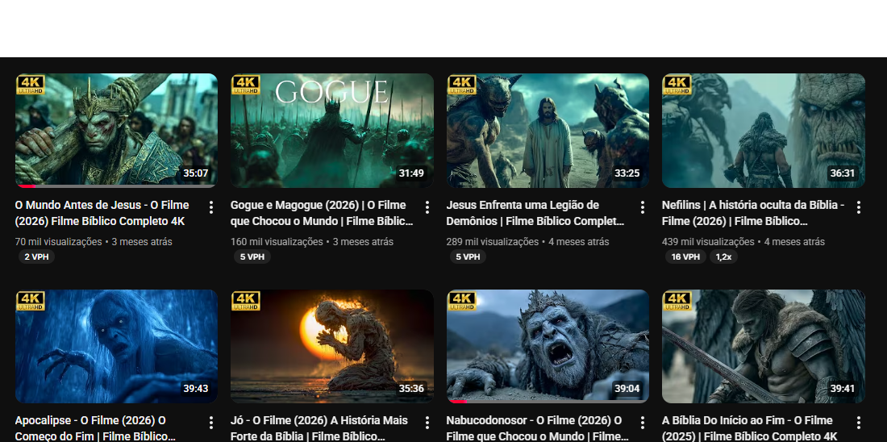

# Thumbnail Original do Canal

Miniatura original coletada do canal **@HistoriasdaBiblia.oficial** utilizada como referência para extração do DNA visual (VDNA).

Esta imagem foi utilizada para identificar:

- composição cinematográfica
- escala de personagem
- iluminação dramática
- hierarquia visual
- atmosfera narrativa

---

## Thumbnail analisada

---

## Características observadas

- personagem dominante na composição
- iluminação dramática cinematográfica
- cenário épico ou bíblico
- forte contraste entre personagem e fundo
- narrativa visual clara
